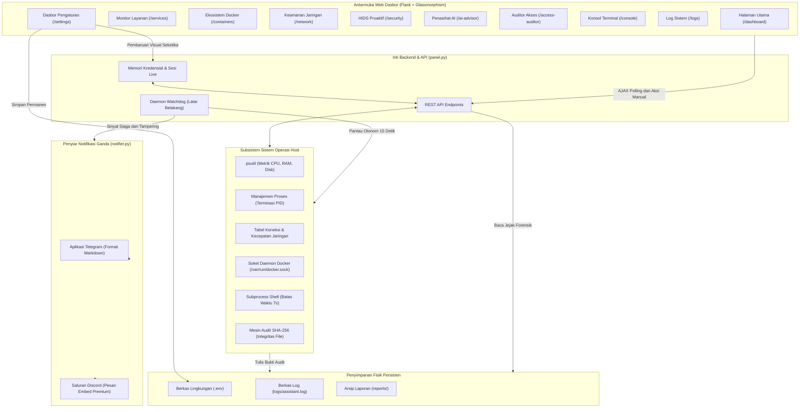

# 📚 Dokumentasi Terperinci Menu SecOps Panel

Dokumentasi ini disusun secara khusus untuk memberikan pemahaman mendalam tentang **fungsi**, **kegunaan praktis**, serta **mekanisme kerja internal** dari setiap menu yang tersedia di dalam **SecOps Panel**. 

Panduan ini sangat direkomendasikan bagi Administrator atau *DevSecOps Engineer* yang akan memasang, mengonfigurasi, dan mengoperasikan platform ini di lingkungan produksi.

---

## 📊 Flowchart Arsitektur Sistem & Aliran Kerja

Diagram di bawah ini memvisualisasikan bagaimana antarmuka web, inti backend Flask, daemon *Watchdog* latar belakang, subsistem OS Host, serta saluran penyiar notifikasi ganda saling berinteraksi secara mulus:

---

## 🧭 Daftar Menu & Pusat Kendali

### 1. Overview (`/dashboard`)
*Pusat kendali visibilitas waktu nyata untuk pemantauan kesehatan global host.*

- **Fungsi & Kegunaan:** Menyajikan rangkuman eksekutif status server host, mencakup metrik pemanfaatan komputasi (CPU, RAM, dan kapasitas penyimpanan), persentase total Skor Risiko Global, rasio layanan aktif, serta jumlah kontainer Docker yang sedang beroperasi.
- **Cara Kerja Internal:** Halaman ini melakukan *polling* latar belakang secara konstan melalui protokol AJAX ke endpoint backend (`/api/stats`). Data metrik fisik diambil secara langsung dari sistem kernel host menggunakan pustaka `psutil` dan diterjemahkan menjadi visualisasi grafik dinamis bergaya *glassmorphism* tanpa membebani utas (*thread*) utama aplikasi.

---

### 2. Services Monitor (`/services`)
*Pengawas proses host dengan kemampuan terminasi tingkat kernel.*

- **Fungsi & Kegunaan:** Memberikan administrator kemampuan untuk menginspeksi seluruh daftar proses atau layanan (*service*) yang sedang berjalan di OS host. Sangat berguna untuk mengidentifikasi proses asing yang memakan memori tinggi dan mematikan paksa (*Kill Process*) aktivitas mencurigakan.
- **Cara Kerja Internal:** Backend mengumpulkan seluruh tabel proses aktif (mencakup PID, Nama Proses, Status, dan Penggunaan Memori RSS) secara seketika. Ketika tombol **Hentikan** ditekan, sistem melontarkan sinyal terminasi paksa (`os.kill` dengan `SIGTERM`/`SIGKILL` pada Linux, atau instruksi `TerminateProcess` pada Windows) terhadap PID terkait yang dilindungi dengan mekanisme konfirmasi ganda untuk mencegah salah klik.

---

### 3. Docker Ecosystem (`/containers`)
*Jembatan pengelola instans kontainer terisolasi tanpa antarmuka baris perintah (CLI).*

- **Fungsi & Kegunaan:** Memantau daftar lengkap kontainer Docker yang ada di mesin host beserta status siklus hidupnya (*Running*, *Exited*, *Created*). Memungkinkan pengguna melakukan eksekusi cepat untuk **Start**, **Stop**, dan **Restart** kontainer secara langsung dari peramban web.
- **Cara Kerja Internal:** Menggunakan integrasi *Pure SDK* melalui pustaka `docker-py` yang menyambung langsung ke soket kontrol fisik daemon Docker host (`/var/run/docker.sock` atau *named pipe* Windows). Setiap instruksi tombol dari antarmuka web diterjemahkan menjadi panggilan API tingkat kernel Docker, memberikan umpan balik status instan kepada administrator.

---

### 4. Network Security (`/network`)
*Radar analitik lalu lintas data dan audit soket komunikasi mendalam.*

- **Fungsi & Kegunaan:** Terbagi menjadi dua kapabilitas utama:
  1. **Speedometer Bandwidth Live:** Menampilkan laju transfer unggah (*Upload*) dan unduh (*Download*) aktual jaringan secara seketika.
  2. **Active Connections Auditor:** Menginspeksi seluruh soket TCP dan UDP yang sedang membuka koneksi keluar maupun masuk, mempermudah pelacakan komunikasi peretas ke peladen perintah (*Command & Control / C2*).
- **Cara Kerja Internal:** Meteran kecepatan dihitung dengan mengakumulasi selisih penghitung byte antarmuka fisik (`net_io_counters`) setiap interval waktu tertentu. Inspektur soket membaca tabel jaringan sistem operasi dan memetakan setiap pasangan *Local Address*, *Remote Address*, dan *Port* ke nama layanan aslinya (*Process Name*) agar transparan.

---

### 5. Proactive HIDS (`/security`)
*Mesin deteksi intrusi host otonom, pemantau integritas berkas (FIM), dan manajer pencekalan.*

- **Fungsi & Kegunaan:** 
  - **FIM (File Integrity Monitoring):** Melindungi berkas konfigurasi atau kode inti dari penyisipan *backdoor* tak kasat mata.
  - **Firewall Ban Manager:** Menampilkan daftar alamat IP penyerang yang sedang dicekal sementara akibat upaya masuk paksa (*brute-force* $\ge$ 3 kali) maupun yang masuk dalam daftar hitam permanen, lengkap dengan opsi **Pencabutan Cekal (*Unban*)** dan pendaftaran cekal baru secara manual.
- **Cara Kerja Internal:** Mesin audit FIM menghitung nilai sidik jari kriptografi **SHA-256** dari setiap berkas rujukan secara berkala dan membandingkannya dengan kondisi asli (*baseline*). Jika terdeteksi ketidakcocokan sekecil apa pun, status berkas berubah menjadi **MODIFIED** berdenyut merah. Pengguna dapat menekan tombol **Otorisasi Perubahan** untuk memperbarui *baseline hash* yang baru jika modifikasi tersebut sah.

---

### 6. AI Threat Advisor (`/ai-advisor`)
*Penasihat siber cerdas penyintesis ramalan serangan dan rekomendasi mitigasi otonom.*

- **Fungsi & Kegunaan:** Mengubah data pemantauan pasif menjadi laporan intelijen prediktif yang mudah dipahami. Menyajikan ulasan keamanan dalam bahasa alami dan memetakan ancaman masa depan (seperti *Cryptojacking*, pembajakan memori, atau eksploitasi layanan jarak jauh) lengkap dengan tingkat probabilitas, dampak, dan petunjuk langkah perbaikan.
- **Cara Kerja Internal:** Bekerja sebagai **mesin inferensi heuristik**. Algoritma mengevaluasi kombinasi anomali lintas subsistem (beban CPU $\ge$ 85%, RAM kritis, status *tampering* FIM, serta terbukanya port publik rentan tanpa enkripsi seperti FTP/RDP) untuk mencetak **Risk Score** absolut dan tingkat **Confidence Score AI** secara riil.

---

### 7. Access Auditor (`/access-auditor`)
*Radar pengawas jalur administratif jarak jauh dengan pencatatan forensik persisten.*

- **Fungsi & Kegunaan:** Mengawasi secara khusus soket kendali jarak jauh interaktif yang paling sering diserang peretas: **Port 22** (jalur OpenSSH, SFTP, WinSCP) dan **Port 3389** (jalur *Remote Desktop Protocol / RDP* Windows). Memfasilitasi terminasi paksa soket penyerang dan menyimpan jejak alamat IP penyusup ke dalam log persisten.
- **Cara Kerja Internal:** Modul menyaring lalu lintas soket jaringan host yang tertuju pada port jarak jauh. Jika ada koneksi eksternal yang aktif bersamaan dengan terdeteksinya modifikasi berkas FIM, sistem otomatis menandainya sebagai insiden **Forensic Tampering**. Jejak pendaratan dicatat langsung ke dalam berkas fisik `logs/remote_access.log` yang tetap utuh melintasi siklus *restart* server.

---

### 8. Terminal Console (`/console`)
*Emulator cangkang eksekusi instruksi sistem host yang diisolasi dengan proteksi waktu habis.*

- **Fungsi & Kegunaan:** Memberikan antarmuka terminal bergaya *cyber matrix* gelap untuk menjalankan perintah administratif sistem operasi langsung dari peramban (misalnya: `ipconfig`, `netstat -ano`, `ping`).
- **Cara Kerja Internal:** Perintah teks dikirim melalui protokol REST API (`/api/console/run`) dan dieksekusi oleh OS host menggunakan pustaka `subprocess`. Untuk mencegah skrip yang macet atau perintah interaktif tanpa akhir (*infinite loop*) melumpuhkan peladen web, subsistem ini dibekali pengaman **Failsafe Timeout 7 Detik** yang akan membatalkan paksa instruksi jika melampaui batas waktu.

---

### 9. System Logs (`/logs`)
*Arsip forensik transparan untuk peninjauan riwayat aktivitas sistem dan hasil audit.*

- **Fungsi & Kegunaan:** Menampilkan catatan aktivitas *real-time* dari subsistem asisten keamanan (mulai dari inisialisasi daemon, pemblokiran IP oleh *Watchdog*, hingga penghentian proses). Halaman ini juga berfungsi sebagai laci penyimpanan arsip laporan teks pemindaian manual yang diurutkan berdasarkan tanggal.
- **Cara Kerja Internal:** Membaca baris-baris terakhir dari berkas fisik log internal (`logs/assistant.log`) secara aman, serta memindai isi direktori `reports/` untuk memuat daftar laporan riwayat pemindaian sistem secara lengkap.

---

### 10. Pengaturan (`/settings`)
*Dasbor kendali visual mutakhir untuk pembaruan kredensial dan penyiar notifikasi ganda.*

- **Fungsi & Kegunaan:** Memberikan antarmuka grafis yang premium dan ramah pengguna untuk mengubah kredensial autentikasi dasbor (**Username** dan **Password**) serta mengatur saluran integrasi notifikasi pihak ketiga (**Telegram Bot Token**, **Telegram Chat ID**, dan **Discord Webhook URL**) tanpa perlu mengedit kode sumber Python secara manual.
- **Cara Kerja Internal:** Menggunakan mekanisme **Hot-Reload Tanpa Restart**. Setiap pengiriman formulir akan langsung menimpa variabel global di dalam memori aplikasi dan menyuntikkan nilai baru ke dalam *environment* OS (`os.environ`). Selanjutnya, pustaka `python-dotenv` mengeksekusi fungsi `set_key` untuk menuliskan konfigurasi secara permanen ke dalam berkas `.env` lokal dengan tetap mempertahankan format dan komentar bawaan.
- **Fitur Penyiar Ganda (*Dual Broadcaster*):** Modul notifikasi terhubung secara otonom ke subsistem pengawas latar belakang (*Watchdog*). Ketika utilisasi CPU mencapai ambang batas kritis atau terjadi pelanggaran integritas berkas (FIM), peringatan darurat disiarkan secara serentak ke Telegram dan saluran teks Discord dalam format **Pesan Embed Berwarna Premium** yang menyesuaikan dengan tingkat bahaya insiden.

---
*Dokumentasi Resmi SecOps Panel & DevSecOps Suite • Dirancang untuk Keandalan dan Visibilitas Maksimal.*
